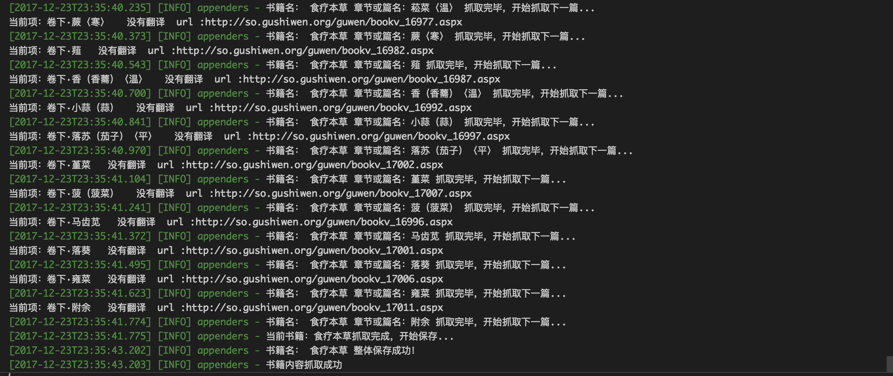

## guwen-spider

git clone https://github.com/yangfan0095/guwen-spider.git

npm install

npm run start


说明： 本来写这个项目这是一个用于学习和交流的用途， 但是从昨天晚上到今天早上上班这个时间段 ，在掘金上面大概有1200多人阅读，然后这个项目很多同学一拉下来直接跑一遍，对我们要爬取的这个对象网站来说就意味着大约2万 * N 的访问量。这个网站不是链家或者知乎这种大型互联网公司。从昨天晚上到现在，平时这个访问量一周只有不到10万的网站 ，访问量暴增到140万。 这其中绝大部分都是爬虫。所以我们的行为虽然本质上是纯粹的技术交流，但是影响了第三方的运营。因此现在我一些相关的配置参数全部屏蔽了。希望大家能够理解。如果真的需要这些数据用以研究而自己没有办法获取到，可以email联系我 。




写完这个项目 做了一个基于React开的前端网站用于页面浏览 和一个基于koa2.x开发的服务端, 整体技术栈相当于是 React + Redux + Koa2 ,前后端服务是分开部署的，各自独立可以更好的去除前后端服务的耦合性，比如同一套服务端代码，不仅可以给web端 还可以给 移动端 ，app 提供支持。目前整个一套还很简陋，但是可以满足基本的查询浏览功能。希望后期有时间可以把项目变得更加丰富。

* 本项对应前端 React + Redux + semantic-ui   地址 : [guwen-react](https://github.com/yangfan0095/guwen-react)
* 本项对应Node端 Koa2.2 + mongoose  地址 : [guwen-node](https://github.com/yangfan0095/guwen-node)

## 项目体会
### 前言
˜
之前研究数据，零零散散的写过一些数据抓取的爬虫，不过写的比较随意。有很多地方现在看起来并不是很合理 这段时间比较闲，本来是想给之前的项目做重构的。
后来 利用这个周末，索性重新写了一个项目，就是本项目 guwen-spider。目前这个爬虫还是比较简单的类型的， 直接抓取页面，然后在页面中提取数据，保存数据到数据库。
通过与之前写的对比，我觉得难点在于整个程序的健壮性，以及相应的容错机制。在昨天写代码的过程中其实也有反映， 真正的主体代码其实很快就写完了 ，花了大部分时间是在
做稳定性的调试， 以及寻求一种更合理的方式来处理数据与流程控制的关系。

### 背景

项目的背景是抓取一个一级页面是目录列表 ，点击一个目录进去 是一个章节 及篇幅列表 ，点击章节或篇幅进入具体的内容页面。

### 概述
**项目技术细节**

项目大量用到了 ES7 的async 函数, 更直观的反应程序了的流程。为了方便，在对数据遍历的过程中直接使用了著名的async这个库，所以不可避免的还是用到了回调promise ，因为数据的处理发生在回调函数中，不可避免的会遇到一些数据传递的问题，其实也可以直接用ES7的async await 写一个方法来实现相同的功能。这里其实最赞的一个地方是使用了 Class 的 static 方法封装对数据库的操作， static 顾名思义 静态方法 就跟 prototype 一样 ，不会占用额外空间。
项目主要用到了 
* 1 ES7的 async await 协程做异步有关的逻辑处理。
* 2 使用 npm的 async库 来做循环遍历，以及并发请求操作。
* 3 使用 log4js 来做日志处理
* 4 使用 cheerio 来处理dom的操作。
* 5 使用 mongoose 来连接mongoDB 做数据的保存以及操作。


**目录结构**

<pre>
├── bin              // 入口
│   ├── booklist.js         // 抓取书籍逻辑
│   ├── chapterlist.js      // 抓取章节逻辑
│   ├── content.js          // 抓取内容逻辑
│   └── index.js            // 程序入口
├── config             // 配置文件
├── dbhelper           // 数据库操作方法目录
├── logs             // 项目日志目录
├── model         // mongoDB 集合操作实例
├── node_modules         
├── utils         // 工具函数
├── package.json       
</pre>

**项目实现方案分析**

项目是一个典型的多级抓取案例，目前只有三级，即 书籍列表， 书籍项对应的 章节列表，一个章节链接对应的内容。 抓取这样的结构可以采用两种方式， 一是 直接从外层到内层 内层抓取完以后再执行下一个外层的抓取， 还有一种就是先把外层抓取完成保存到数据库，然后根据外层抓取到所有内层章节的链接，再次保存，然后从数据库查询到对应的链接单元 对之进行内容抓取。这两种方案各有利弊，其实两种方式我都试过， 后者有一个好处，因为对三个层级是分开抓取的， 这样就能够更方便，尽可能多的保存到对应章节的相关数据。 可以试想一下 ，如果采用前者 按照正常的逻辑
对一级目录进行遍历抓取到对应的二级章节目录， 再对章节列表进行遍历 抓取内容，到第三级 内容单元抓取完成 需要保存时，如果需要很多的一级目录信息，就需要 这些分层的数据之间进行数据传递 ，想想其实应该是比较复杂的一件事情。所以分开保存数据 一定程度上避开了不必要的复杂的数据传递。

目前我们考虑到 其实我们要抓取到的古文书籍数量并不多，古文书籍大概只有180本囊括了各种经史。其和章节内容本身是一个很小的数据 ，即一个集合里面有180个文档记录。 这180本书所有章节抓取下来一共有一万六千个章节，对应需要访问一万六千个页面爬取到对应的内容。所以选择第二种应该是合理的。

**项目实现**

主程有三个方法 bookListInit ,chapterListInit,contentListInit, 分别是抓取书籍目录，章节列表，书籍内容的方法对外公开暴露的初始化方法。通过async 可以实现对这三个方法的运行流程进行控制，书籍目录抓取完成将数据保存到数据库，然后执行结果返回到主程序，如果运行成功 主程序则执行根据书籍列表对章节列表的抓取，同理对书籍内容进行抓取。 

**项目主入口**

```
/**
 * 爬虫抓取主入口
 */
const start = async() => {
    let booklistRes = await bookListInit();
    if (!booklistRes) {
        logger.warn('书籍列表抓取出错，程序终止...');
        return;
    }
    logger.info('书籍列表抓取成功，现在进行书籍章节抓取...');

    let chapterlistRes = await chapterListInit();
    if (!chapterlistRes) {
        logger.warn('书籍章节列表抓取出错，程序终止...');
        return;
    }
    logger.info('书籍章节列表抓取成功，现在进行书籍内容抓取...');

    let contentListRes = await contentListInit();
    if (!contentListRes) {
        logger.warn('书籍章节内容抓取出错，程序终止...');
        return;
    }
    logger.info('书籍内容抓取成功');
}
// 开始入口
if (typeof bookListInit === 'function' && typeof chapterListInit === 'function') {
    // 开始抓取
    start();
}

```

引入的 bookListInit ,chapterListInit,contentListInit,  三个方法

booklist.js
```
/**
 * 初始化方法 返回抓取结果 true 抓取成果 false 抓取失败
 */
const bookListInit = async() => {
    logger.info('抓取书籍列表开始...');
    const pageUrlList = getPageUrlList(totalListPage, baseUrl);
    let res = await getBookList(pageUrlList);
    return res;
}

```
chapterlist.js

```
/**
 * 初始化入口
 */
const chapterListInit = async() => {
    const list = await bookHelper.getBookList(bookListModel);
    if (!list) {
        logger.error('初始化查询书籍目录失败');
    }
    logger.info('开始抓取书籍章节列表，书籍目录共：' + list.length + '条');
    let res = await asyncGetChapter(list);
    return res;
};
```

content.js
```
/**
 * 初始化入口
 */
const contentListInit = async() => {
    //获取书籍列表
    const list = await bookHelper.getBookLi(bookListModel);
    if (!list) {
        logger.error('初始化查询书籍目录失败');
        return;
    }
    const res = await mapBookList(list);
    if (!res) {
        logger.error('抓取章节信息，调用 getCurBookSectionList() 进行串行遍历操作，执行完成回调出错，错误信息已打印，请查看日志!');
        return;
    }
    return res;
}

```

**内容抓取的思考**

书籍目录抓取其实逻辑非常简单，只需要使用async.mapLimit做一个遍历就可以保存数据了,但是我们在保存内容的时候 简化的逻辑其实就是 遍历章节列表 抓取链接里的内容。但是实际的情况是链接数量多达几万 我们从内存占用角度也不能全部保存到一个数组中，然后对其遍历，所以我们需要对内容抓取进行单元化。
普遍的遍历方式 是每次查询一定的数量，来做抓取，这样缺点是只是以一定数量做分类，数据之间没有关联，以批量方式进行插入，如果出错 则容错会有一些小问题，而且我们想一本书作为一个集合单独保存会遇到问题。因此我们采用第二种就是以一个书籍单元进行内容抓取和保存。
这里使用了 `async.mapLimit(list, 1, (series, callback) => {})`这个方法来进行遍历，不可避免的用到了回调，感觉很恶心。async.mapLimit()的第二个参数可以设置同时请求数量。
```
 /* 
 * 内容抓取步骤：
 * 第一步得到书籍列表， 通过书籍列表查到一条书籍记录下 对应的所有章节列表， 
 * 第二步 对章节列表进行遍历获取内容保存到数据库中 
 * 第三步 保存完数据后 回到第一步 进行下一步书籍的内容抓取和保存
 */

/**
 * 初始化入口
 */
const contentListInit = async() => {
    //获取书籍列表
    const list = await bookHelper.getBookList(bookListModel);
    if (!list) {
        logger.error('初始化查询书籍目录失败');
        return;
    }
    const res = await mapBookList(list);
    if (!res) {
        logger.error('抓取章节信息，调用 getCurBookSectionList() 进行串行遍历操作，执行完成回调出错，错误信息已打印，请查看日志!');
        return;
    }
    return res;
}
/**
 * 遍历书籍目录下的章节列表
 * @param {*} list 
 */
const mapBookList = (list) => {
    return new Promise((resolve, reject) => {
        async.mapLimit(list, 1, (series, callback) => {
            let doc = series._doc;
            getCurBookSectionList(doc, callback);
        }, (err, result) => {
            if (err) {
                logger.error('书籍目录抓取异步执行出错!');
                logger.error(err);
                reject(false);
                return;
            }
            resolve(true);
        })
    })
}

/**
 * 获取单本书籍下章节列表 调用章节列表遍历进行抓取内容
 * @param {*} series 
 * @param {*} callback 
 */
const getCurBookSectionList = async(series, callback) => {

    let num = Math.random() * 1000 + 1000;
    await sleep(num);
    let key = series.key;
    const res = await bookHelper.querySectionList(chapterListModel, {
        key: key
    });
    if (!res) {
        logger.error('获取当前书籍: ' + series.bookName + ' 章节内容失败，进入下一部书籍内容抓取!');
        callback(null, null);
        return;
    }
    //判断当前数据是否已经存在
    const bookItemModel = getModel(key);
    const contentLength = await bookHelper.getCollectionLength(bookItemModel, {});
    if (contentLength === res.length) {
        logger.info('当前书籍：' + series.bookName + '数据库已经抓取完成，进入下一条数据任务');
        callback(null, null);
        return;
    }
    await mapSectionList(res);
    callback(null, null);
}


```
**数据抓取完了 怎么保存是个问题**

这里我们通过key 来给数据做分类，每次按照key来获取链接，进行遍历，这样的好处是保存的数据是一个整体，现在思考数据保存的问题 
* 1 可以以整体的方式进行插入 
   
    优点 : 速度快 数据库操作不浪费时间。 

    缺点 : 有的书籍可能有几百个章节 也就意味着要先保存几百个页面的内容再进行插入，这样做同样很消耗内存，有可能造成程序运行不稳定。 
* 2可以以每一篇文章的形式插入数据库。
    
    优点 : 页面抓取即保存的方式 使得数据能够及时保存，即使后续出错也不需要重新保存前面的章节， 
    
    缺点 : 也很明显 就是慢 ，仔细想想如果要爬几万个页面 做 几万次*N 数据库的操作 这里还可以做一个缓存器一次性保存一定条数 当条数达到再做保存这样也是一个不错的选择。

```
/**
 * 遍历单条书籍下所有章节 调用内容抓取方法
 * @param {*} list 
 */
const mapSectionList = (list) => {
    return new Promise((resolve, reject) => {
        async.mapLimit(list, 1, (series, callback) => {
            let doc = series._doc;
            getContent(doc, callback)
        }, (err, result) => {
            if (err) {
                logger.error('书籍目录抓取异步执行出错!');
                logger.error(err);
                reject(false);
                return;
            }
            const bookName = list[0].bookName;
            const key = list[0].key;

            // 以整体为单元进行保存
            saveAllContentToDB(result, bookName, key, resolve);

            //以每篇文章作为单元进行保存
            // logger.info(bookName + '数据抓取完成，进入下一部书籍抓取函数...');
            // resolve(true);

        })
    })
}

```
两者各有利弊，这里我们都做了尝试。 准备了两个错误保存的集合,errContentModel, errorCollectionModel,在插入出错时 分别保存信息到对应的集合中，二者任选其一即可。增加集合来保存数据的原因是 便于一次性查看以及后续操作， 不用看日志。

（PS ，其实完全用 errorCollectionModel 这个集合就可以了  ，errContentModel这个集合可以完整保存章节信息）
```
//保存出错的数据名称
const errorSpider = mongoose.Schema({
    chapter: String,
    section: String,
    url: String,
    key: String,
    bookName: String,
    author: String,
})
// 保存出错的数据名称 只保留key 和 bookName信息
const errorCollection = mongoose.Schema({
    key: String,
    bookName: String,
})

```


我们将每一条书籍信息的内容 放到一个新的集合中，集合以key来进行命名。

## 总结

写这个项目 其实主要的难点在于程序稳定性的控制，容错机制的设置，以及错误的记录，目前这个项目基本能够实现直接运行 一次性跑通整个流程。 但是程序设计也肯定还存在许多问题 ，欢迎指正和交流。


写完这个项目 做了一个基于React开的前端网站用于页面浏览 和一个基于koa2.x开发的服务端, 
整体技术栈相当于是 React + Redux + Koa2
本项对应前端   地址[guwen-react](https://github.com/yangfan0095/guwen-react)
本项对应Node端 地址[guwen-node](https://github.com/yangfan0095/guwen-node)

项目挺简单的 ，但是多了一个学习和研究 从前端到服务端的开发的环境。


以上です
